---
## Front matter
lang: ru-RU
title: Лабораторная работа №3
author: |
	Филиппова Анна Дмитриевна НПМбд-02-20\inst{1}
institute: |
	\inst{1}RUDN University, Moscow, Russian Federation
date: 29 апреля, 2021, Москва, Россия

## Formatting
toc: false
slide_level: 2
theme: metropolis
header-includes: 
 - \metroset{progressbar=frametitle,sectionpage=progressbar,numbering=fraction}
 - '\makeatletter'
 - '\beamer@ignorenonframefalse'
 - '\makeatother'
aspectratio: 43
section-titles: true
---

## Цель работы

Научиться оформлять отчёты с помощью легковесного языка разметки Markdown

## Задание

Сделайте отчёт по предыдущей лабораторной работе в формате Markdown.
В качестве отчёта просьба предоставить отчёты в 3 форматах:pdf, docx и md(в архиве,поскольку он должен содержать скринскриншоты,Makefile ит.д.)

# Выполнение лабораторной работы

Создаем учётную запись на https://github.com. Учетная запись называется adfilippova.
Настраиваем систему контроля версий git. Синхронизируем учётную запись github с компьютером. Затем создаём новый ключ на и привязываем его к компьютеру через консоль.(рис. -@fig:001)

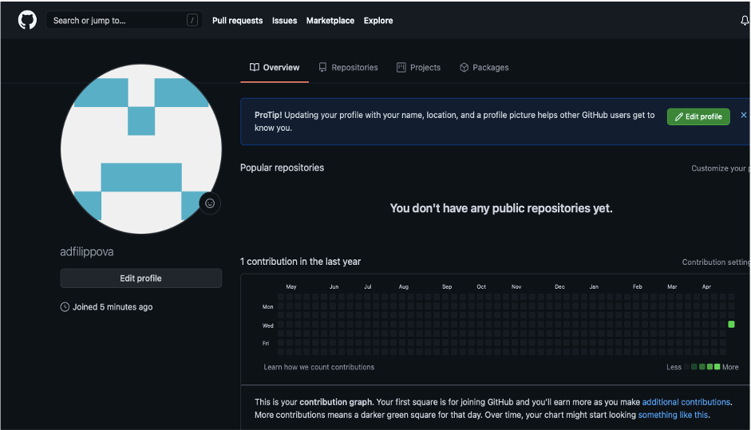{ #fig:001 width=70% }

## Выполнение лабораторной работы

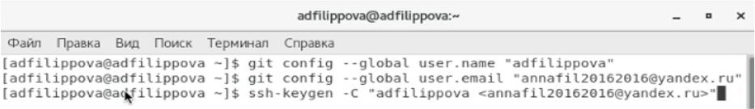{ #fig:001 width=70% }
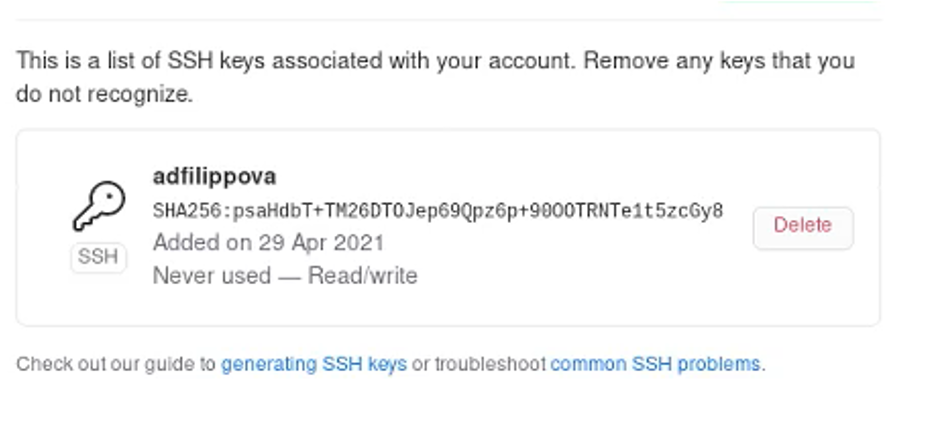{ #fig:001 width=70% }

## Выполнение лабораторной работы

Созданием и подключаем репозиторий к github. На сайте заходим в «repository» и создаём новый репозиторий под названием os-intro1. Переносим его на наш компьютер.
Создаем рабочий каталог.(рис. -@fig:002)

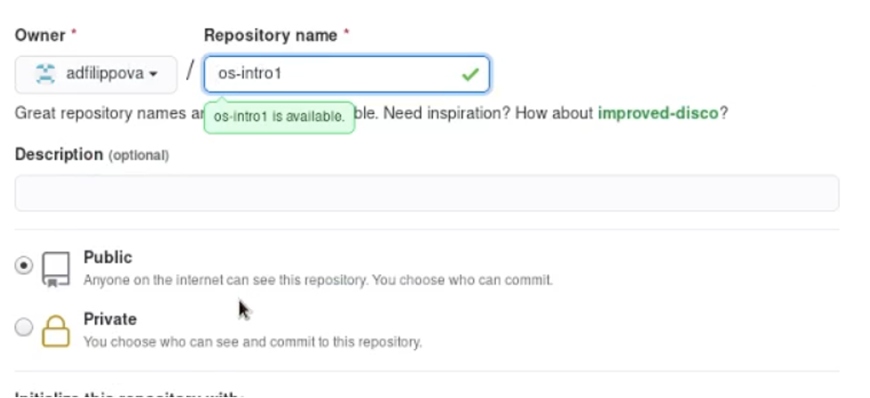{ #fig:002 width=70% }
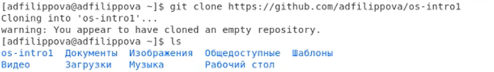{ #fig:002 width=70% }

## Выполнение лабораторной работы

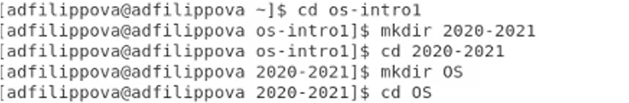{ #fig:002 width=70% }
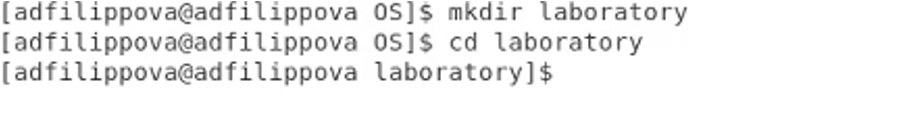{ #fig:002 width=70% }
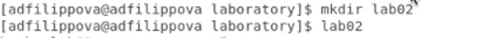{ #fig:002 width=70% }

## Выполнение лабораторной работы

Добавляем первый коммит и выкладываем на github. Для того, чтобы правильно разместить первый коммит, необходимо добавить команду git add ., после этого с помощью команды git commit -am "first commit" выкладываем коммит. Сохраняем первый коммит, используя команду git push.
Первичная конфигурация.
Добавляем файл лицензии. Добавляем шаблон игнорируемых файлов. Просматриваем список
имеющихся шаблонов. (рис. -@fig:003)

## Выполнение лабораторной работы

{ #fig:003 width=70% }
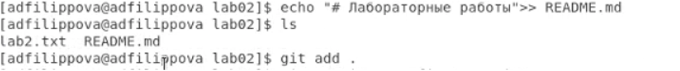{ #fig:003 width=70% }
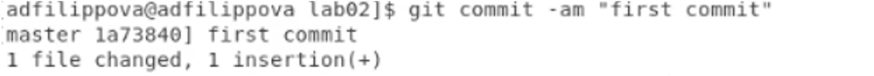{ #fig:003 width=70% }
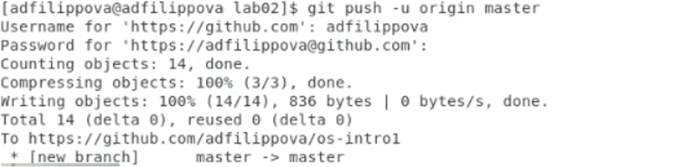{ #fig:003 width=70% }

## Выполнение лабораторной работы

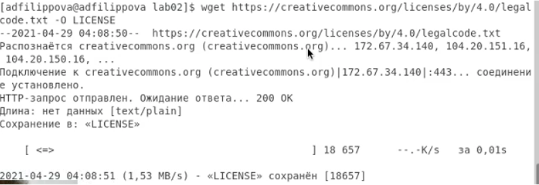{ #fig:003 width=70% }
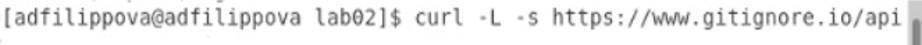{ #fig:003 width=70% }

## Выполнение лабораторной работы

Скачиваем шаблон (например, для C) и выполняем коммит. Отправляем на github. (команда gitpush) 
Работаем с конфигурацией git-flow.У нас не получилось установить git-flow, так как root этого не допустил. В связи с этим дальнейшие действия выполнить невозможно. (рис. -@fig:004)

## Выполнение лабораторной работы

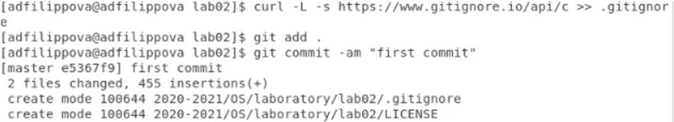{ #fig:004 width=70% }
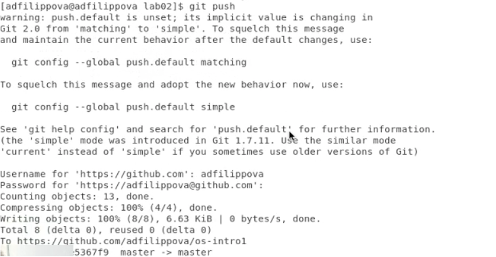{ #fig:004 width=70% }

## Выполнение лабораторной работы

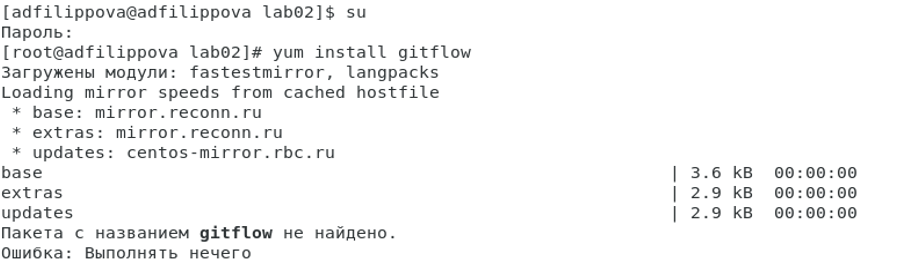{ #fig:004 width=70% }

## Вывод

Я изучила идеологию и научилась применять средства контроля версий.

