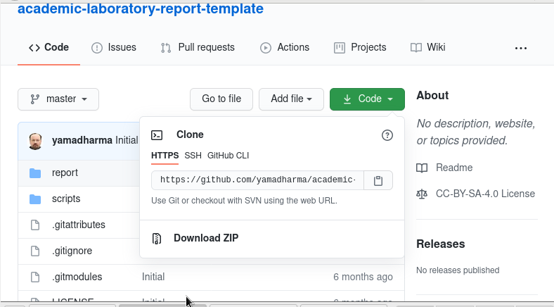
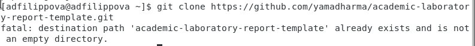
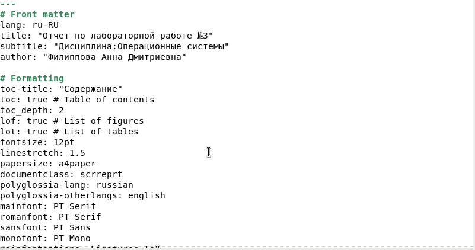

---
## Front matter
lang: ru-RU
title: Лабораторная работа №3
author: |
	Филиппова Анна Дмитриевна\inst{1}
institute: |
	\inst{1}RUDN University, Moscow, Russian Federation
date: 29 апреля, 2021, Москва, Россия

## Formatting
toc: false
slide_level: 2
theme: metropolis
header-includes: 
 - \metroset{progressbar=frametitle,sectionpage=progressbar,numbering=fraction}
 - '\makeatletter'
 - '\beamer@ignorenonframefalse'
 - '\makeatother'
aspectratio: 43
section-titles: true
---

## Цель работы

Научиться оформлять отчёты с помощью легковесного языка разметки Markdown.

## Задание

Сделайте отчёт по предыдущей лабораторной работе в формате Markdown.
В качестве отчёта просьба предоставить отчёты в 3 форматах: pdf, docx и md (в архиве, поскольку он должен содержать скриншоты, Makefile и т.д.)

## Ход работы

Скачачиваем шаблон для отчета. (рис. -@fig:001)

{ #fig:001 width=70% }

## Ход работы

{ #fig:002 width=70% } 

## Ход работы

Переходим к отчету и  редактируем отчет. (рис. -@fig:003)

{ #fig:003 width=70% }

## Ход работы

Далее с помощью команды make сохранем отчет в форматах docx, pdf, но всвязи с тем, что не получалось установить pandoc-crossref, то файл в этих форматах получить не удалось. (рис. -@fig:004)

{ #fig:004 width=70% }

## Вывод

В ходе данной лабораторной работы я научилась оформлять отчёты с помощью легковесного языка разметки Markdown.

