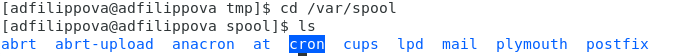
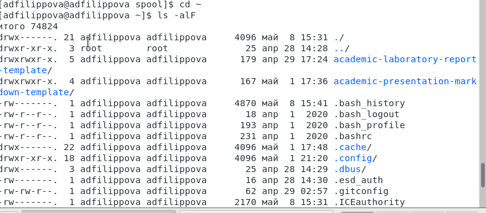
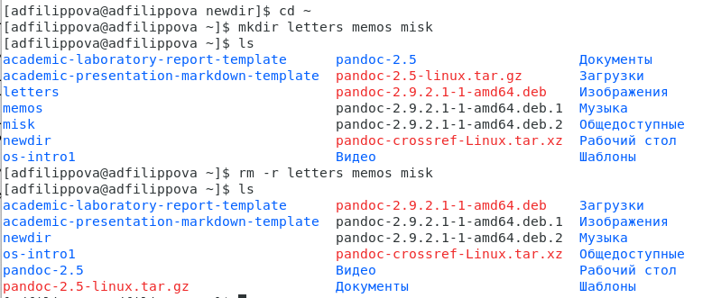
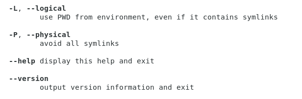
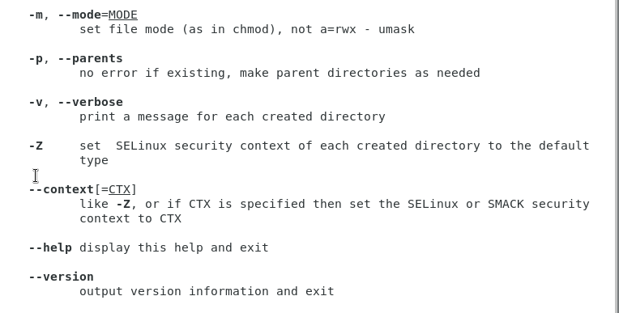
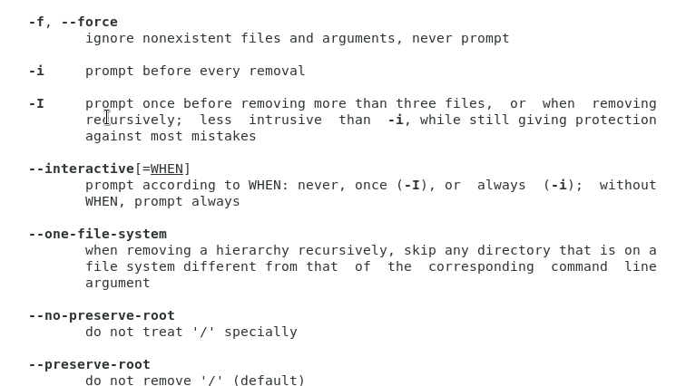

---
# Front matter
lang: ru-RU
title: "Отчет по лабораторной работе №5"
subtitle: "Дисциплина"
author: "Филиппова Анна Дмитриевна"

# Formatting
toc-title: "Содержание"
toc: true # Table of contents
toc_depth: 2
lof: true # List of figures
fontsize: 12pt
linestretch: 1.5
papersize: a4paper
documentclass: scrreprt
polyglossia-lang: russian
polyglossia-otherlangs: english
mainfont: PT Serif
romanfont: PT Serif
sansfont: PT Sans
monofont: PT Mono
mainfontoptions: Ligatures=TeX
romanfontoptions: Ligatures=TeX
sansfontoptions: Ligatures=TeX,Scale=MatchLowercase
monofontoptions: Scale=MatchLowercase
indent: true
pdf-engine: lualatex
header-includes:
  - \linepenalty=10 # the penalty added to the badness of each line within a paragraph (no associated penalty node) Increasing the value makes tex try to have fewer lines in the paragraph.
  - \interlinepenalty=0 # value of the penalty (node) added after each line of a paragraph.
  - \hyphenpenalty=50 # the penalty for line breaking at an automatically inserted hyphen
  - \exhyphenpenalty=50 # the penalty for line breaking at an explicit hyphen
  - \binoppenalty=700 # the penalty for breaking a line at a binary operator
  - \relpenalty=500 # the penalty for breaking a line at a relation
  - \clubpenalty=150 # extra penalty for breaking after first line of a paragraph
  - \widowpenalty=150 # extra penalty for breaking before last line of a paragraph
  - \displaywidowpenalty=50 # extra penalty for breaking before last line before a display math
  - \brokenpenalty=100 # extra penalty for page breaking after a hyphenated line
  - \predisplaypenalty=10000 # penalty for breaking before a display
  - \postdisplaypenalty=0 # penalty for breaking after a display
  - \floatingpenalty = 20000 # penalty for splitting an insertion (can only be split footnote in standard LaTeX)
  - \raggedbottom # or \flushbottom
  - \usepackage{float} # keep figures where there are in the text
  - \floatplacement{figure}{H} # keep figures where there are in the text
---

# Цель работы

Приобрести практических навыков взаимодействия пользователя с системой посредством командной строки.

# Выполнение лабораторной работы

  1.Определяем полное имя домашнего каталога, используя команду «pwd».(рис. -@fig:001)

{ #fig:001 width=70% }

  2.1 Переходим в каталог /tmp, используя команду «cd /tmp».(рис. -@fig:002)

.png){ #fig:002 width=70% }

  2.2 Выводим на экран содержимое каталога /tmp, используя команду «ls» с различными опциями.
1)«ls» − выводится список каталогов и файлов, которые можно увидеть,открыв каталог tmp.(рис. -@fig:003)

 { #fig:003 width=70% }

2) «ls -a» − к файлам, полученным при использовании команды "ls", добавляются скрытые каталоги и файлы. (рис. -@fig:004)

{ #fig:004 width=70% }

3) «ls -F» − с помощью этой команды получаем информацию о типах файлов. (рис. -@fig:005)

{ #fig:005 width=70% }

4) «ls -alF» − данная команда отображает список всех каталогов и файлов, в том числе и скрытых, с подробной информацией о них. (рис. -@fig:006)

{ #fig:006 width=70% }

5) «ls -l» − получаем список каталогов и файлов, но уже с более подробной информацией о них. (рис. -@fig:007)

{ #fig:007 width=70% }

  2.3 Переходим в указанный каталог с помощью команды «cd /var/spool», просматриваем его содержимое, используя команду «ls», и видим, что данный подкаталог существует. (рис. -@fig:008)

{ #fig:008 width=70% }

   2.4 Переходим в свой домашний каталог с помощью команды «cd ~», используем команду «ls -alF» и выводим на экран его содержимое. Видим, что владельцем всех каталогов и
файлов, кроме родительского каталога, владельцем которого являтся пользователь root, является пользователь adfilippova. (рис. -@fig:009)

{ #fig:009 width=70% }

  3.1 В домашнем каталоге создаем новый каталог newdir, используя команду «mkdir newdir». (рис. -@fig:010)

{ #fig:010 width=70% }
  
  3.2 Переходим в ранее созданный каталог newdir командой «cd newdir» и там создаем каталог morefun, используя команду «mkdir morefun». (рис. -@fig:011)

{ #fig:011 width=70% }

  3.3 Используем команду «mkdir letters memos misk», создаем в домашнем каталоге три новых. Далее с помощью команды «rm –r letters memos misk» удаляем созданные каталоги.(рис. -@fig:012)

{ #fig:012 width=70% }

  3.4 Пробуем удалить каталог newdir командой «rm newdir». Получаем отказ в выполнении команды, данный каталог содержит подкаталог morefun (при удалении требуется использовать опцию -r).(рис. -@fig:013)

{ #fig:013 width=70% }

  3.5 Удаляем каталог newdir/morefun, используя команду «rm –r newdir/morefun».(рис. -@fig:014)

{ #fig:014 width=70% }

.png){ #fig:014 width=70% }

  4. Используя команду «man ls», определяем, какую опцию команды ls необходимо использовать, чтобы просмотреть содержимое не только указанного каталога, но и подкаталогов, входящих в него. (рис. -@fig:015)

{ #fig:015 width=70% }

.png){ #fig:015 width=70% }

  5. С помощью команды "man ls"  определяем набор опций команды ls,позволяющий отсортировать по времени последнего изменения выводимый списоксодержимого каталога с развернутым описанием файлов. (рис. -@fig:016)

{ #fig:016 width=70% }

.png){ #fig:016 width=70% }

.png){ #fig:016 width=70% }

  6. Используем команды «man cd», «man pwd», «man mkdir», «man rmdir»,«man rm», просматриваем описание соответствующих команд. (рис. -@fig:017) 

{ #fig:017 width=70% }

  Команда cd не имеет дополнительных опций. (рис. -@fig:018)

{ #fig:018 width=70% }
 
  Команда pwd (рис. -@fig:019)
-L, --logical не разыменовывает символические ссылки. Если путь содержит символические ссылки, то выводит их без преобразования в исходный путь;
-P, --physical преобразовывает(отбрасывает символические ссылки) символические ссылки в исходные имена. Если путь содержит символические ссылки, то они будут преобразованы в
названия исходных директорий, на которые они указывают;
--help показает справку по команде pwd;
--version показает версию утилиты pwd.

{ #fig:019 width=70% }

  Команда mkdir (рис. -@fig:020)
-m, --mode=MODE устанавливает права доступа для создаваемой директории;
-p, --parents создает все директории, которые указаны внутри пути. Если
какая-либо директория существует, то предупреждение об этом не выводится;
-v, --verbose выводи сообщение о каждой создаваемой директории;
-Z устанавливает контекст SELinux для создаваемой директории по умолчанию;
--context[=CTX] устанавливает контекст SELinux для создаваемой директории в значение CTX;
--help показывает справку по команде mkdir;
--version показывает версию утилиты mkdir. 

{ #fig:020 width=70% }
 
  Команда rmdir (рис. -@fig:021)
--ignore-fail-on-non-empty игнорует директории, которые содержат в себе файлы;
-p, --parents в этой опции каждый аргумент каталога обрабатывается как путь, из которого будут удалены все компоненты, если они уже пусты, начиная с последнего компонента;
-v, --verbose отображает подробную информацию для каждого обрабатываемого каталога;
--help показывает справку по команде rmdir;
--version показывает версию утилиты rmdir.

{ #fig:021 width=70% }

  Команда rm (рис. -@fig:022)
-f, --force игнорирует несуществующие файлы и аргументы. Никогда не выдавает запросы на подтверждение удаления;
-i выводит запрос на подтверждение удаления каждого файла;
-I выдает один запрос на подтверждение удаления всех файлов, если удаляется больше трех файлов или используется рекурсивное удаление.
--interactive[=WHEN] вместо WHEN можно использовать:
never — никогда не выдавать запросы на подтверждение удаления. 
once — выводить запрос один раз (аналог опции -I).
always — выводить запрос всегда (аналог опции -i).
Если значение КОГДА не задано, то используется always;
--one-file-system во время рекурсивного удаления пропускает директории, которые находятся на других файловых системах;
--no-preserve-root если в качестве директории для удаления задан корневой раздел /, то считает, что это обычная директория и начинает выполнять удаление;
--preserve-root[=all] если в качестве директории для удаления задан корневой раздел /,
то запрещает выполнять команду rm над корневым разделом. Данное поведение используется по умолчанию;
-r, -R, --recursive удаляет директории и их содержимое. Рекурсивное удаление;
-d, --dir удаляет пустые директории;
-v, --verbose выводит информацию об удаляемых файлах;
--help показывает справку по команде rm;
--version показывает версию утилиты rm. 

{ #fig:022 width=70% }

.png){ #fig:022 width=70% }

  7. Выведем историю команд с помощью команды «history». Выполняем модификацию и исполнение нескольких команд «!259:s/newdir/new» и «!277». (рис. -@fig:023)

{ #fig:023 width=70% }

{ #fig:023 width=70% }

{ #fig:023 width=70% }

# Выводы

Я приобрела практические навыки взаимодействия с системой посредством командной строки.

# Контрольные вопросы

1. Командная строка – специальная программа, позволяющая управлять операционной системой при помощи текстовых команд, вводимых в окне приложения.

2. Для определения абсолютного пути к текущему каталогу используется команда pwd. Команда «pwd» в моем домашнем каталоге выведет: /home/adfilippova.

3. Команда «ls -F» выведет имена файлов в текущем каталоге и их типы.
Тип каталога обозначается /, тип исполняемого файла обозначается *,тип ссылки обозначается @. Пример: (рис. -@fig:005).

4. Имена скрытых файлов начинаются с точки. Эти файлы в операционной системе скрыты от просмотра и обычно используются для настройки рабочей среды. Для того, чтобы отобразить имена скрытых файлов, необходимо использовать команду «ls –a». Пример: (рис. -@fig:004).

5. Команда rm используется для удаления файлов и/или каталогов. Команда rm -i выдает запрос подтверждения на удаление файла.Команда rm -r необходима, чтобы удалить каталог, содержащий файлы.Без указания этой опции команда не будет выполняться. Если каталог
пуст, то можно воспользоваться командой rmdir. Если удаляемый каталог содержит файлы, то команда не будет выполнена – нужно использовать «rm -r имя_каталога». Таким образом, каталог, не содержащий файлов, можно удалить и командой rm, и командой rmdir. Файл командой rmdir удалить нельзя. Пример: (рис. -@fig:013), (рис. -@fig:014).

6. Чтобы определить, какие команды выполнил пользователь в сеансе работы, необходимо воспользоваться командой «history».

7. Чтобы исправить или запустить на выполнение команду, которуюпользователь уже использовал в сеансе работы, необходимо: в первом случае: воспользоваться !<номер_команды>:s/<что_меняем>/<на_что_меняем>, конструкцией во втором случае: !<номер_команды>. Пример: (рис. -@fig:023).

8. Чтобы записать в одной строке несколько команд, необходимо между ними поставить ; . Например, «cd /tmp; ls».

9. Символ обратного слэша \ позволяет использовать управляющие символы ( ".", "/", "$", "*", "[", "]", "^", "&") без их интерпретации командной оболочкой; процедура добавления данного символа перед управляющими символами называется экранированием символов. Например, команда «ls newdir\/morefun» отобразит содержимое каталога newdir/morefun.

10. Команда «ls -l» отображает список каталогов и файлов с подробной информацией о них (тип файла, право доступа, число ссылок, владелец, размер, дата последней ревизии, имя файла или каталога).

11. Полный, абсолютный путь от корня файловой системы – этот путь начинается от корня "/" и описывает весь путь к файлу или каталогу; Относительный путь – это путь к файлу относительно текущего каталога (каталога, где находится пользователь). Например, «cd
/newdir/morefun» – абсолютный путь, «cd newdir» – относительный путь.

12. Чтобы получить необходимую информацию о команде, необходимо воспользоваться конструкцией man [имя_команды], либо использовать опцию help, которая предусмотрена для некоторых команд.

13. Для автоматического дополнения вводимых команд служит клавиша Tab.
