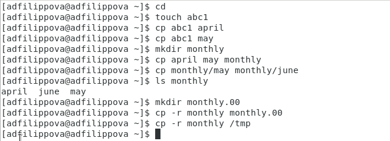

---
## Front matter
lang: ru-RU
title: Лабораторная работа №6
author: |
	Филиппова Анна Дмитриевна inst{1}
institute: |
	\inst{1}RUDN University, Moscow, Russian Federation
date: 12 мая, 2021, Москва, Россия

## Formatting
toc: false
slide_level: 2
theme: metropolis
header-includes: 
 - \metroset{progressbar=frametitle,sectionpage=progressbar,numbering=fraction}
 - '\makeatletter'
 - '\beamer@ignorenonframefalse'
 - '\makeatother'
aspectratio: 43
section-titles: true
---

## Цель работы

Ознакомление с файловой системой Linux, её структурой, именами и содержанием каталогов.
Приобретение практических навыков по применению команд для работы с файлами и каталогами, по управлению процессами (и работами), по проверке использования диска и обслуживанию файловой системы.

## Выполнение лабораторной работы

 1. Выполняем примеры, описанные в первой части описания лабораторной работы.(рис. -@fig:001)

{ #fig:001 width=70% }

## Выполнение лабораторной работы

 2. Выполняем копирование файла, создаем директории, перемещаем и переименовываем файлы, создаем и перемещаем каталоги. (рис. -@fig:002). (рис. -@fig:003)

.png){ #fig:002 width=70% }

## Выполнение лабораторной работы

.png){ #fig:003 width=70% }

## Выполнение лабораторной работы

 3. Определяем с помощью команды chomd, которые небходимы, чтобы присвоить файлам необходимые права доступа. (рис. -@fig:004), (рис. -@fig:005)

.png){ #fig:004 width=70% }

## Выполнение лабораторной работы

.png){ #fig:005 width=70% }

## Выполнение лабораторной работы

 4. Просматриваем содержимое файла,копируем файлы премещаем их в каталоги, даем владельцу, права на чтение, на выполнение, лишаем этих прав и тд. (рис. -@fig:006), (рис. -@fig:007)

.png){ #fig:006 width=70% }

## Выполнение лабораторной работы

.png){ #fig:007 width=70% }

## Выполнение лабораторной работы

 5. Используя команды «man mount», «man fsck», «man mkfs», «man kill», получим информацию о соответствующих командах. (рис. -@fig:008)

.png){ #fig:008 width=70% }

## Вывод

 Я ознакомилась с файловой системой Linux, её структурой, именами и содержанием каталогов, получила навыки по применению команд для работы с файлами и каталогами, по управлению процессами (и работами), по проверке использования диска и обслуживанию файловой системы.
