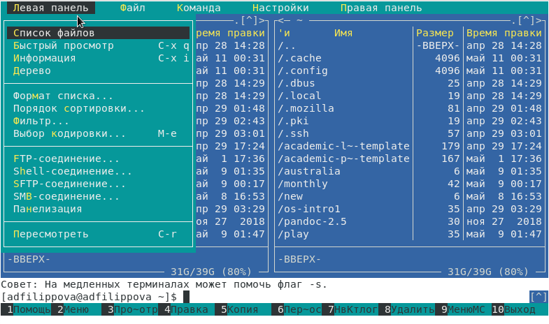
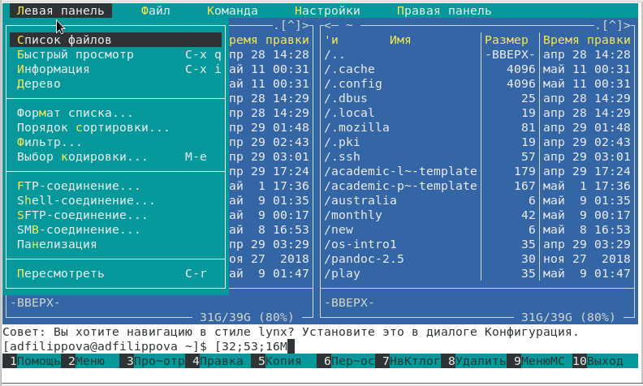
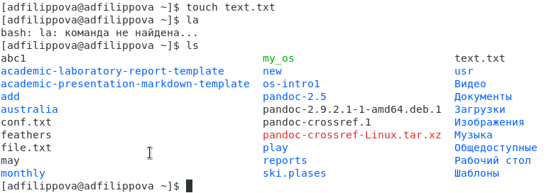
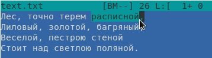
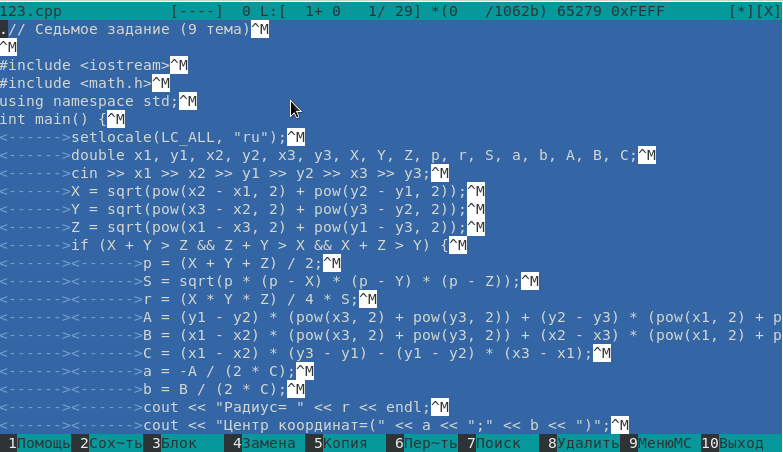

---
## Front matter
lang: ru-RU
title: Лабораторная работа №8
author: |
	Филиппова Анна Дмитриевна inst{1}
institute: |
	\inst{1}RUDN University, Moscow, Russian Federation
date: 13 мая, 2021, Москва, Россия

## Formatting
toc: false
slide_level: 2
theme: metropolis
header-includes: 
 - \metroset{progressbar=frametitle,sectionpage=progressbar,numbering=fraction}
 - '\makeatletter'
 - '\beamer@ignorenonframefalse'
 - '\makeatother'
aspectratio: 43
section-titles: true
---

## Цель работы

 Освоение основных возможностей командной оболочки Midnight Commander. Приобретение навыков практической работы попросмотру каталогов и файлов, манипуляций с ними.

## Выполнение лабораторной работы

1 ЗАДАНИЕ

 Изучаем информацию о mc, вызвав в командной строке «man mc». Midnight Commander (или mc) − псевдографическая командная оболочка для UNIX/Linux систем. Запустим из командной строки mc и изучим его структуру и меню. (рис. -@fig:001) 

{ #fig:001 width=70% }

## Выполнение лабораторной работы

 Верхнее меню содержит меню «Левая панель», «Файл», «Команда», «Настройки», «Правая панель». (рис. -@fig:002)

{ #fig:002 width=70% }

## Выполнение лабораторной работы

 Выполняем операции в mc, используя управляющие клавиши, выполняем основные команды левой панели меню, используем возможности подменю "Файл", подменю "Команда" подменю "Настройки". (рис. -@fig:003)

{ #fig:003 width=70% }

## Выполнение лабораторной работы

 2 ЗАДАНИЕ
 С помощью команды «touch text.txt» создаем текстовой файл text.txt.  (рис. -@fig:004)

{ #fig:004 width=70% }

## Выполнение лабораторной работы

 Вставим небольшой фагмент текста из интернета. Отредактриуем его используя горячие клавиши. (рис. -@fig:005)

{ #fig:005 width=70% } 

## Выполнение лабораторной работы

 Откроем файл с исходным текстом на некотором языке программирования. Откроем файл в редакторе mc с помощью команды «mc/123.cpp». Используя меню редактора «Команда» - «Включить/выключить подсветку синтаксиса», выключим подсветку синтаксиса. (рис. -@fig:006)

{ #fig:006 width=70% }

## Вывод

Я освоила основные возможности командной оболочки Midnight Commander и приобрела навыки практической работы по просмотру каталогов и файловб, манипуляций с ними.
 
