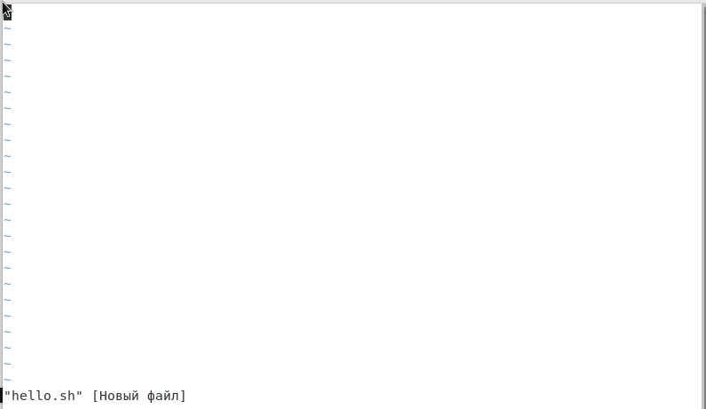
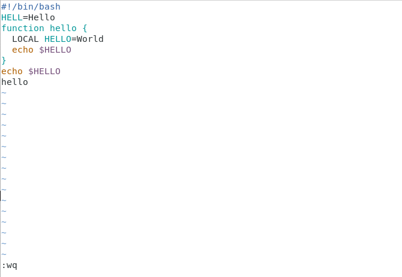
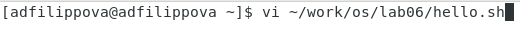
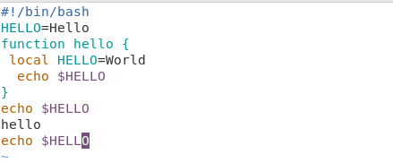

---
## Front matter
lang: ru-RU
title: Лабораторная работа №9
author: |
	Филиппова Анна Дмитриевна inst{1}
institute: |
	\inst{1}RUDN University, Moscow, Russian Federation
date: 17 мая, 2021, Москва, Россия

## Formatting
toc: false
slide_level: 2
theme: metropolis
header-includes: 
 - \metroset{progressbar=frametitle,sectionpage=progressbar,numbering=fraction}
 - '\makeatletter'
 - '\beamer@ignorenonframefalse'
 - '\makeatother'
aspectratio: 43
section-titles: true
---

## Цель работы

  Познакомиться с операционной системой Linux. Получить практические навыки работы с редактором vi, установленным по умолчанию практически во всех дистрибутивах.

## Выполнение лабораторной работы

1. Я ознакомилась с теоретическим материалом.

2. Я ознакомилась с редактором vi.

3. Выполняем упражения, используя команды vi.

## Выполнение лабораторной работы

 1 ЗАДАНИЕ

4. Создаем файл hello.sh,перейдя в режим вставки, вводим указанный в лабораторной работе текст. (рис. -@fig:001) 

{ #fig:001 width=70% }

## Выполнение лабораторной работы

5. Переходим в режим последней строки, сохраняем наш текст и завершаем работу делаем файл исполняемым. (рис. -@fig:002)

{ #fig:002 width=70% } 

## Выполнение лабораторной работы

 2 ЗАДАНИЕ

6. Вызовем vi для редактирования файла.   (рис. -@fig:003)

{ #fig:003 width=70% } 

## Выполнение лабораторной работы

7. Редактируем текст, удаляем и вставляем слова, отменяем изменения и тд. Записываем произведенные изменения и выходим из vi. (рис. -@fig:004)

{ #fig:004 width=70% }

## Вывод

 Я познакомилась с операционной системой Linux и получила практические навыки работы с редактором vi.

