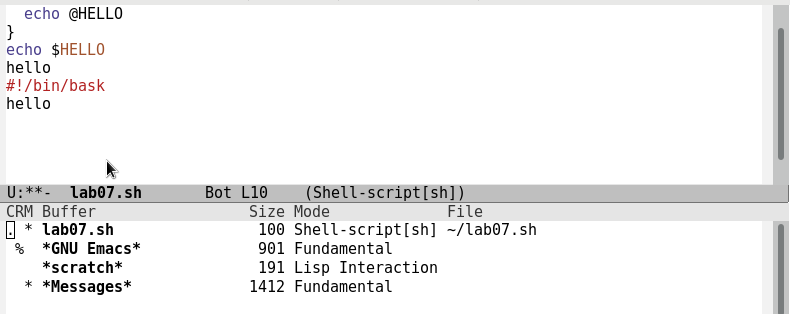

---
## Front matter
lang: ru-RU
title: Лабораторная работа №10
author: |
	Филиппова Анна Дмитриевна inst{1}
institute: |
	\inst{1}RUDN University, Moscow, Russian Federation
date: 20 мая, 2021, Москва, Россия

## Formatting
toc: false
slide_level: 2
theme: metropolis
header-includes: 
 - \metroset{progressbar=frametitle,sectionpage=progressbar,numbering=fraction}
 - '\makeatletter'
 - '\beamer@ignorenonframefalse'
 - '\makeatother'
aspectratio: 43
section-titles: true
---

## Цель работы

Познакомиться с операционной системой Linux. Получить практические навыки работы с редактором Emacs.

## Выполнение лабораторной работы

1. Я ознакомилась с теоретическим материалом.

2. Я ознакомилась с редактором emacs.

3. Выполняем упражения.

## Выполнение лабораторной работы

1. Для работы с Emacs необходимо установить данный редактор. (рис. -@fig:001) 

{ #fig:001 width=70% }

## Выполнение лабораторной работы

2. Открываем emacs, создаем файл lab07.sh, набираем текст, сохраняем файл и проделываем с текстом стандартные процедуры редактирования, учимся исользовать команды по пермещению курсора. (рис. -@fig:002) 

{ #fig:002 width=70% }

## Выполнение лабораторной работы
3. Учимся управлять буферами.   (рис. -@fig:003)

{ #fig:003 width=70% }

## Выполнение лабораторной работы

4. Изучаем управление окнами. (рис. -@fig:004)

{ #fig:004 width=70% } 

## Выполнение лабораторной работы

5. Осваиваем режим поиска. (рис. -@fig:005)

{ #fig:005 width=70% } 

## Вывод

Я познакомилась с операционной системой Linux и получила практические навыки работы
с редактором Emacs.
