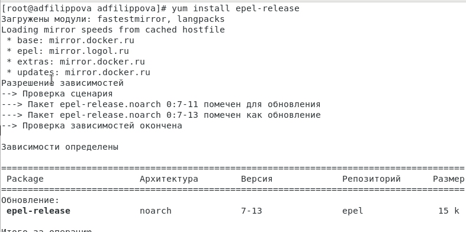

---
# Front matter
lang: ru-RU
title: "Отчет по лабораторной работе №10"
subtitle: "Дисциплина"
author: "Филиппова Анна Дмитриевна"

# Formatting
toc-title: "Содержание"
toc: true # Table of contents
toc_depth: 2
lof: true # List of figures
fontsize: 12pt
linestretch: 1.5
papersize: a4paper
documentclass: scrreprt
polyglossia-lang: russian
polyglossia-otherlangs: english
mainfont: PT Serif
romanfont: PT Serif
sansfont: PT Sans
monofont: PT Mono
mainfontoptions: Ligatures=TeX
romanfontoptions: Ligatures=TeX
sansfontoptions: Ligatures=TeX,Scale=MatchLowercase
monofontoptions: Scale=MatchLowercase
indent: true
pdf-engine: lualatex
header-includes:
  - \linepenalty=10 # the penalty added to the badness of each line within a paragraph (no associated penalty node) Increasing the value makes tex try to have fewer lines in the paragraph.
  - \interlinepenalty=0 # value of the penalty (node) added after each line of a paragraph.
  - \hyphenpenalty=50 # the penalty for line breaking at an automatically inserted hyphen
  - \exhyphenpenalty=50 # the penalty for line breaking at an explicit hyphen
  - \binoppenalty=700 # the penalty for breaking a line at a binary operator
  - \relpenalty=500 # the penalty for breaking a line at a relation
  - \clubpenalty=150 # extra penalty for breaking after first line of a paragraph
  - \widowpenalty=150 # extra penalty for breaking before last line of a paragraph
  - \displaywidowpenalty=50 # extra penalty for breaking before last line before a display math
  - \brokenpenalty=100 # extra penalty for page breaking after a hyphenated line
  - \predisplaypenalty=10000 # penalty for breaking before a display
  - \postdisplaypenalty=0 # penalty for breaking after a display
  - \floatingpenalty = 20000 # penalty for splitting an insertion (can only be split footnote in standard LaTeX)
  - \raggedbottom # or \flushbottom
  - \usepackage{float} # keep figures where there are in the text
  - \floatplacement{figure}{H} # keep figures where there are in the text
---

# Цель работы

 Познакомиться с операционной системой Linux. Получить практические навыки работы с редактором Emacs. 

# Выполнение лабораторной работы
 
1. Я ознакомилась с теоретическим материалом.

2. Я ознакомилась с редактором emacs.

3. Выполняем упражения. 

1 ЗАДАНИЕ
 
1. Для работы с Emacs необходимо установить данный редактор. (рис. -@fig:001) (рис. -@fig:002) 

{ #fig:001 width=70% }

{ #fig:002 width=70% }

2. Откроем редактор Emacs с помощью команды «emacs &». (рис. -@fig:003) 

{ #fig:003 width=70% }

3. Создадим файл lab07.sh с помощью комбинации «Ctrl-x» «Ctrl-f». (рис. -@fig:004)

{ #fig:004 width=70% }

4. Набираем необходимый текст. (рис. -@fig:005)

{ #fig:005 width=70% }

5. 1) Сохраним файл с помощью комбинации «Ctrl-x» «Ctrl-s». 

   2) Вырежем одной командой целую строку  «Сtrl-k». (рис. -@fig:006)
   
{ #fig:006 width=70% } 
   
   3) Вставим эту строку в конец файла «Ctrl-y». (рис. -@fig:007)

{ #fig:007 width=70% } 

   4) Выделим область текста «Ctrl-space». (рис. -@fig:008) 

{ #fig:008 width=70% } 
   
   5) Скопируем область в буфер обмена «Alt-w». Вставляем область в конец файла «Ctrl-y». (рис. -@fig:009) 

{ #fig:009 width=70% }

   6) Вновь выделим эту область «Ctrl-space» и на этот раз вырежем её «Ctrl-w». (рис. -@fig:010)

{ #fig:010 width=70% }

   7) Отменим последнее действие «Ctrl-/». (рис. -@fig:011)

{ #fig:011 width=70% }

6.  1) Переместим курсор в начало строки «Ctrl-a». (рис. -@fig:012)

{ #fig:012 width=70% }
  
    2) Переместим курсор в конец строки «Ctrl-e». (рис. -@fig:013)

{ #fig:013 width=70% }

    3) Переместим курсор в начало буфера «Alt-<». (рис. -@fig:014)

{ #fig:014 width=70% }

    4) Переместим курсор в конец буфера «Alt-<». (рис. -@fig:015)

{ #fig:015 width=70% }

7. 1) Выведем список активных буферов на экран «Ctrl-x» «Ctrl-b». (рис. -@fig:016)

{ #fig:016 width=70% }
   
   2) Переместимся во вновь открытое окно «Ctrl-x o» со списком открытых буферов и переключимся на другой буфер. (рис. -@fig:017) (рис. -@fig:018)

{ #fig:017 width=70% }

{ #fig:018 width=70% }

   3) Закроем это окно «Ctrl-x 0». (рис. -@fig:019)

{ #fig:019 width=70% }

   4) Теперь вновь переключимся между буферами, но уже без вывода их списка на экран «Ctrl-x b». (рис. -@fig:020)

{ #fig:020 width=70% }

8.  1) Поделим фрейм на 4 части: разделим фрейм на два окна по вертикали, а затем каждое из этих окон на две части по горизонтали. (рис. -@fig:021) (рис. -@fig:022) (рис. -@fig:023)

{ #fig:021 width=70% } 

{ #fig:022 width=70% } 

{ #fig:023 width=70% } 

   2) В каждом из четырёх созданных окон откроем новый буфер (файл) и введем несколько строк текста. Для этого предварительно создадим эти файлы с помощью команд «touch e1.txt», «touch e2.txt»,«touch e3.txt», «touch e.txt». (рис. -@fig:024) (рис. -@fig:025) (рис. -@fig:026)

{ #fig:024 width=70% } 

{ #fig:025 width=70% } 

{ #fig:026 width=70% } 

9.  1) Переключимся в режим поиска «Ctrl-s» и найдем несколько слов, присутствующих в тексте. (рис. -@fig:027)

{ #fig:027 width=70% } 

   2)  Переключимся между результатами поиска, нажимая «Ctrl-s». (рис. -@fig:028) (рис. -@fig:029)

{ #fig:028 width=70% } 

{ #fig:029 width=70% }
 
  
  3) Выходим из режима поиска, нажав «Ctrl-g». (рис. -@fig:030)

{ #fig:030 width=70% } 

  4) Перейдем в режим поиска и замены «Alt-%», но в связи с тем, что на Cent Os 7, установленном на опреационную систему Mac OS, данное сочетание клавиш не сработало, поэтому данное задание было невозможно выполнить.

  5) Пробуем другой режим поиска, нажав «Alt-s o». Данный вид поиска отличается от обычного тем, что тут считывается строка поиска, которая трактуется как регулярное выражение, и не осуществляется поиск точного совпадения в тексте буфера. Регулярное
выражение − это образец, который обозначает набор строк, возможно, и неограниченный набор. (рис. -@fig:031) (рис. -@fig:032) 

{ #fig:031 width=70% } 

{ #fig:032 width=70% } 

# Выводы

 Я познакомилась с операционной системой Linux и получила практические навыки работы
с редактором Emacs.
 
# Контрольные вопросы

1. Emacs − один из наиболее мощных и широко распространённых
редакторов, используемых в мире Unix. По популярности он
соперничает с редактором vi и его клонами. В зависимости от ситуации,
Emacs может быть:
- текстовым редактором;
- программой для чтения почты и новостей Usenet;
- интегрированной средой разработки (IDE);
- операционной системой и т.д.
Всё это разнообразие достигается благодаря архитектуре Emacs,которая позволяет расширять возможности редактора при помощи языка Emacs Lisp. На языке C написаны лишь самые базовые и низкоуровневые части Emacs, включая полнофункциональныйинтерпретатор языка Lisp. Таким образом, Emacs имеет встроенный язык программирования, который может использоваться для настройки, расширения и изменения поведения редактора. В действительности, большая часть того редактора, с которым пользователи Emacs работают
в наши дни, написана на языке Lisp.

2. Основную трудность для новичков при освоении данного редактора могут составлять большое количество команд, комбинаций клавиш, которые не получится все запомнить с первого раза и поэтоу придется часто обращаться к справочным материалам.

3. Буфер – это объект, представляющий собой текст. Если имеется несколько буферов, то редактировать можно только один. Обычно буфер считывает данные из файла или записывает в файл данные из буфера. Окно – это область экрана, отображающая буфер. При запуске редактора отображается одно окно, но при обращении к некоторым функциям могут открыться дополнительные окна. Окна Emacs и окна графической среды X Window – разные вещи. Одно окно X Window может быть разбито на несколько окон в смысле Emacs, в каждом из которых
отображается отдельный буфер.

4. Да, можно.

5. При запуске Emacs по умолчанию создаются следующие буферы:
- «scratch» (буфер для несохраненного текста)
- «Messages» (журнал ошибок, включающий также информацию,
которая появляется в области EchoArea)
- «GNU Emacs» (справочный буфер о редакторе)

6. C-c | сначала, удерживая «ctrl», нажимаю «c», после – отпускаю обе клавиши и нажимаю «|»
C-c C-| сначала, удерживая «ctrl», нажимаю «с», после – отпускаю обе клавиши и, удерживая «ctrl», нажимаю «|»

7.  Чтобы поделить окно на две части необходимо воспользоваться комбинацией «Ctrl-x 3» (по вертикали) или «Ctrl-x 2» (по горизонтали).

8. Настройки Emacs хранятся в файле .emacs.

9. По умолчанию клавиша «←» удаляет символ перед курсором, но в редакторе её можно переназначить. Для этого необхдимо изменить конфигурацию файла .emacs.

10. Более удобным я считаю редактор emacs, потому что в нем проще открывать другие файлы, можно использовать сразу несколько окон, нет «Командного режима», «Режима ввода», «Режима командной строки», которые являются немного непривычными и в какой-то степени неудобными.
