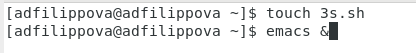
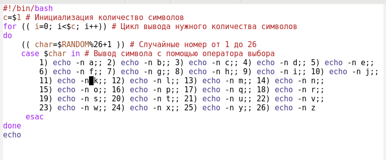
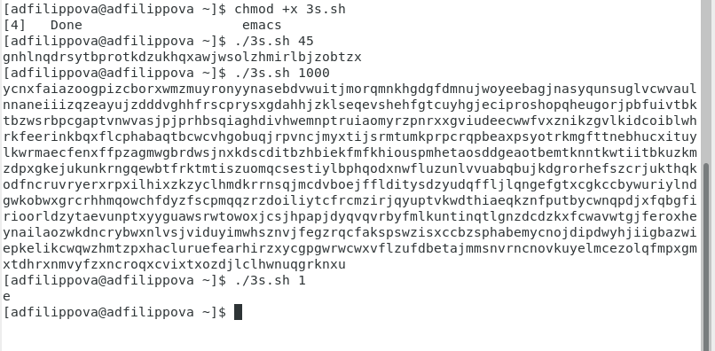

---
## Front matter
lang: ru-RU
title: Лабораторная работа №13
author: |
	Филиппова Анна Дмитриевна inst{1}
institute: |
	\inst{1}RUDN University, Moscow, Russian Federation
date: 1 июня, 2021, Москва, Россия

## Formatting
toc: false
slide_level: 2
theme: metropolis
header-includes: 
 - \metroset{progressbar=frametitle,sectionpage=progressbar,numbering=fraction}
 - '\makeatletter'
 - '\beamer@ignorenonframefalse'
 - '\makeatother'
aspectratio: 43
section-titles: true
---

## Цель работы

 Изучить основы программирования в оболочке ОС UNIX. Научиться писать более сложные командные файлы с использованием логических управляющих конструкций и циклов.

## Выполнение лабораторной работы

1. Создаем файлы, в которых будем писать скрипты, и открываем его в редакторе emacs (команды «touch *.sh» и «emacs &»).(рис. -@fig:001) 

{ #fig:001 width=70% }

## Выполнение лабораторной работы

2. Пишем скрипты и проверяем работу скриптов.(рис. -@fig:002) (рис. -@fig:003)

{ #fig:002 width=70% }

## Выполнение лабораторной работы

{ #fig:003 width=70% } 

## Вывод

 Я изучила основы программирования в оболочке ОС UNIX, а также научилась писать более
сложные командные файлы с использованием логических управляющих конструкций и циклов. 

