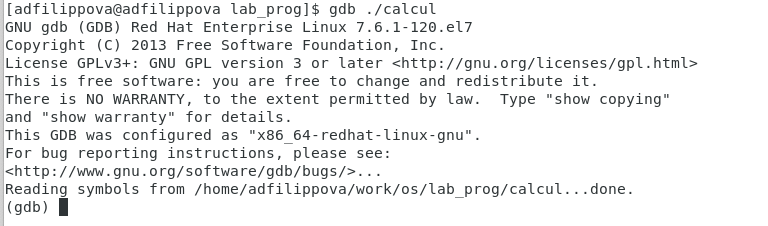

---
## Front matter
lang: ru-RU
title: Лабораторная работа №14
author: |
	Филиппова Анна Дмитриевна inst{1}
institute: |
	\inst{1}RUDN University, Moscow, Russian Federation
date: 1 июня, 2021, Москва, Россия

## Formatting
toc: false
slide_level: 2
theme: metropolis
header-includes: 
 - \metroset{progressbar=frametitle,sectionpage=progressbar,numbering=fraction}
 - '\makeatletter'
 - '\beamer@ignorenonframefalse'
 - '\makeatother'
aspectratio: 43
section-titles: true
---

## Цель работы

 Приобрести простейшие навыки разработки, анализа, тестирования и отладки приложений в ОС типа UNIX/Linux на пример создания на языке программирования С калькулятора с простейшими функциями.

## Выполнение лабораторной работы

1. В домашнем каталоге создаем подкаталог ~/work/os/lab_prog. (рис. -@fig:001) 

{ #fig:001 width=70% }

## Выполнение лабораторной работы

2. Создаем в каталоге файлы: calculate.h, calculate.c, main.c. Они необходимы для написания программ. (рис. -@fig:002) 

{ #fig:002 width=70% }

## Выполнение лабораторной работы

3. Реализация функций калькулятора в файле calculate.с. Интерфейсный файл calculate.h, описывающий формат вызова функции калькулятора. Основной файл main.c, реализующий интерфейс пользователя к калькулятору. (рис. -@fig:003)

{ #fig:003 width=70% }

## Выполнение лабораторной работы

4. Выполняем компиляцию программы посредством gcc. (рис. -@fig:004)

{ #fig:004 width=70% }

## Выполнение лабораторной работы

5. Далее с помощью gdb выполняем отладку программы calcul. (рис. -@fig:005)

{ #fig:005 width=70% }

## Выполнение лабораторной работы

6. С помощью утилиты splint анализируем коды файлов calculate.c и main.c. (рис. -@fig:006)

{ #fig:006 width=70% }

## Вывод

 Я приобрела простейшие навыки разработки, анализа, тестирования и отладки приложений в ОС типа UNIX/Linux на примере создания на языке программирования С калькулятора с простейшими функциями.
